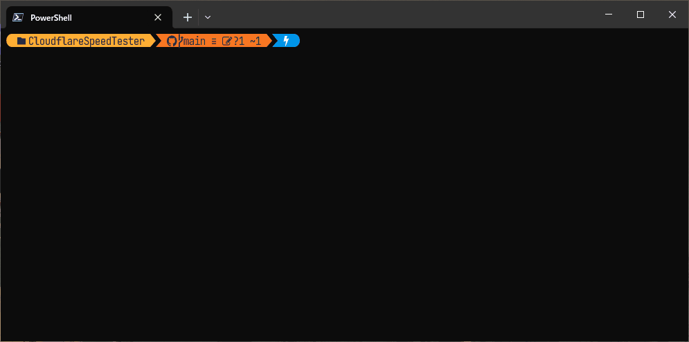

# Cloudflare SpeedTester

Simple Speed Test CLI via **[speed.cloudflare.com](https://speed.cloudflare.com/)**.



## Usage

```ps1
.\CloudflareSpeedTester.exe [OPTIONS]
```

## Options

| Option               | Default | Description                                                                                       |
|----------------------|---------|---------------------------------------------------------------------------------------------------|
| `-h, --help`         |         | Prints help information                                                                           |
| `--display-metadata` | True    | Displays speed test metadata                                                                      |
| `--display-summary`  | True    | Displays speed test summary                                                                       |
| `--display-json`     |         | Displays speed test results in JSON format                                                        |
| `--output-csv `      |         | Specifies the file path to output speed test results in CSV format                                |
| `--output-json `     |         | Specifies the file path to output speed test results in JSON format                               |
| `--force-new`        |         | Flag to overwrite existing files or create new ones for the specified CsvFilePath or JsonFilePath |

## Examples

Example of running CloudflareSpeedTester and outputting the results to a fixed CSV file name:
```ps1
.\CloudflareSpeedTester.exe --output-csv sampling.csv
```

Example of running CloudflareSpeedTester and outputting the results to a CSV file named by the current year and month:
```ps1
.\CloudflareSpeedTester.exe --output-csv ("sampling_" + (Get-Date -Format "yyyy-MM") + ".csv")
```

## MeasurementResult Calculation Methods

The `MeasurementResult` record represents the results of a speed test. Below is a table describing each field and its calculation method:

| Field Name          | Description                                    | Calculation Method                                          |
|---------------------|------------------------------------------------|-------------------------------------------------------------|
| `StartedAt`         | The date and time when the test started (UTC). | Calculated as the timestamp when the test begins.           |
| `DownloadedSpeed`   | The download speed value.                      | Calculated as the 90th percentile of download speeds.       |
| `UploadedSpeed`     | The upload speed value.                        | Calculated as the 90th percentile of upload speeds.         |
| `Latency`           | The latency value.                             | Calculated as the median of latency values.                 |
| `Jitter`            | The jitter value.                              | Calculated as the average jitter from latency values.       |
| `DownloadedLatency` | The latency value during download.             | Calculated as the median of latency values during download. |
| `DownloadedJitter`  | The jitter value during download.              | Calculated as the average jitter during download.           |
| `UploadedLatency`   | The latency value during upload.               | Calculated as the median of latency values during upload.   |
| `UploadedJitter`    | The jitter value during upload.                | Calculated as the average jitter during upload.             |

## Acknowledgments

- [Cloudflare Speedtest](https://github.com/cloudflare/speedtest): Reference for implementing internet speed tests.
- [CsvHelper](https://github.com/JoshClose/CsvHelper): Library for reading and writing CSV files.
- [MinVer](https://github.com/adamralph/minver): Tool for semantic versioning based on Git tags.
- [Spectre.Console](https://spectreconsole.net/): Library for creating beautiful console applications.
- [Tech Icons](https://techicons.dev/icons/cloudflare): Source of project icons.
